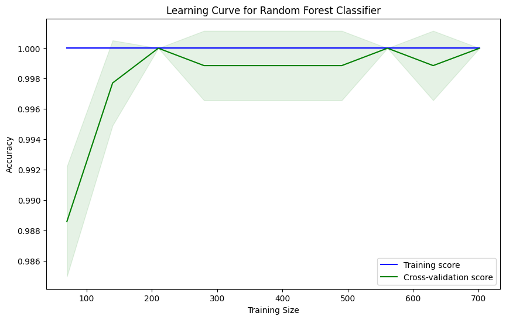

# Model Prediksi Dropout Mahasiswa

## Import Library

## Install Pip

## Load Dataset

## Contoh Kode Model
## Nama Kelompok:
1. Revo Pratama - G1A022058
2. Ahmad Radesta - G1A022086
3. Ari Setiawan - G1A022092


```python
# Mengimpor pustaka yang diperlukan
import pandas as pd  # Untuk manipulasi data
import numpy as np  # Untuk operasi numerik
import matplotlib.pyplot as plt  # Untuk visualisasi data
import seaborn as sns  # Untuk visualisasi data yang lebih kompleks
from sklearn.model_selection import train_test_split  # Untuk membagi dataset menjadi data latih dan data uji
from sklearn.preprocessing import StandardScaler, LabelEncoder  # Untuk normalisasi data dan encoding kategori
from imblearn.over_sampling import SMOTE # Menggunakan SMOTE untuk menangani ketidakseimbangan kelas
from sklearn.ensemble import RandomForestClassifier  # Untuk model Random Forest
from sklearn.metrics import accuracy_score, confusion_matrix, classification_report  # Untuk mengevaluasi model
import warnings
warnings.filterwarnings('ignore')  # Untuk mengabaikan peringatan yang muncul selama eksekusi

```

## Deskripsi

Notebook ini membahas model prediksi dropout mahasiswa berdasarkan data demografis dan akademik. Proses yang dilakukan meliputi:
- Eksplorasi data
- Pra-pemrosesan (data cleaning, encoding, scaling)
- Pemodelan menggunakan algoritma klasifikasi (misalnya Logistic Regression, Decision Tree, dll.)
- Evaluasi model (akurasi, confusion matrix, dll.)

## Requirements

- Python ≥ 3.7
- scikit-learn
- pandas
- matplotlib
- seaborn
- jupyter

## Cara Menjalankan

1. Buka Jupyter Notebook
2. Jalankan file `Model_Prediksi Dropout.ipynb`
3. Ikuti sel secara berurutan untuk melihat hasil prediksi dropout

## Evaluasi



